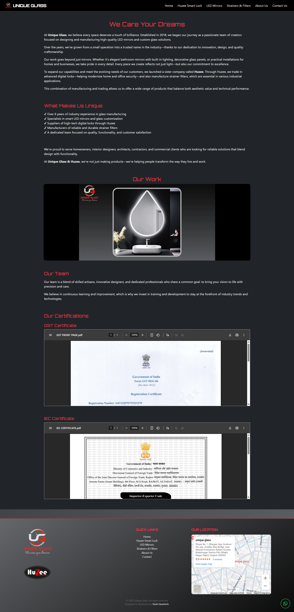
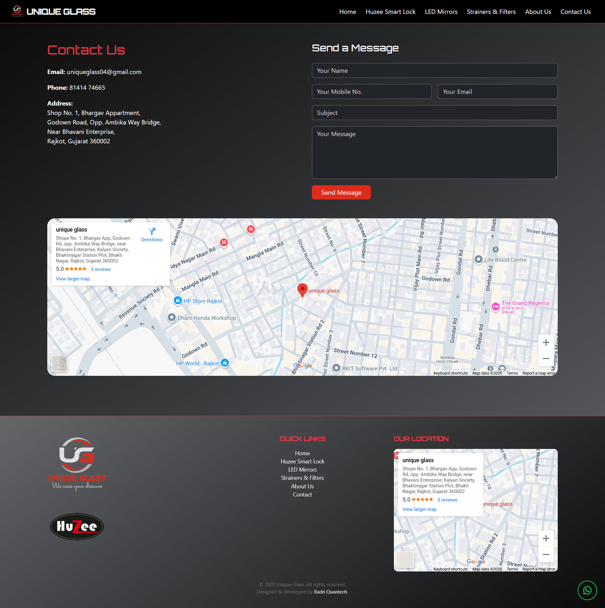

# Unique Glass - Business Website 🏢✨  

A modern, responsive website developed for **Unique Glass Rajkot**, a glass and aluminum solutions provider.  
The site showcases products, services, and contact details, providing an elegant online presence with a smooth user experience.  

🔗 Live Website: [https://uniqueglassrajkot.com/](https://uniqueglassrajkot.com/)  

---

## 📖 About the Project  
The website is designed to represent **Unique Glass Rajkot**, highlighting their wide range of products and services in the glass and aluminum industry. It features a clean UI, product highlights, and a simple way for customers to get in touch.  

The design ensures mobile-friendliness, smooth animations, and a professional layout to attract and engage customers.  

---

## ✨ Features  
- 📌 **Responsive Design** – Optimized for desktop, tablet, and mobile devices.  
- 🛠️ **Product & Services Showcase** – Highlights key offerings in glass and aluminum solutions.  
- ✨ **Smooth Animations** – Integrated **AOS (Animate on Scroll)** for modern UI feel.  
- 📧 **Contact Form** – Built with **EmailJS** for direct communication without server-side code.  
- 🚀 **Fast & Lightweight** – Built using simple HTML, CSS, and JS.  
- 🌍 **SEO Optimized** – Discoverable via search engines.  

---

## 🛠️ Tech Stack  
- **Frontend:** HTML, CSS, JavaScript  
- **UI Framework:** Bootstrap  
- **Animations:** AOS (Animate on Scroll)  
- **Contact Form:** EmailJS  
- **Hosting:** Custom Domain Hosting  
- **Version Control:** Git & GitHub  

---

## 📷 Screenshots  

Create a `screenshots/` folder in your project and add the following images:  

```

screenshots/
├── homepage.png
├── about.png
├── products.png
├── services.png
├── contact.png

````

Example usage in README:  

- **Homepage**  
    

- **About Section**  
    

- **Products Section**  
    

- **Services Section**  
    

- **Contact Section**  
    

---

## 🚀 Deployment  
The website is hosted on a **custom domain**:  
🔗 [https://uniqueglassrajkot.com/](https://uniqueglassrajkot.com/)  

To run locally:  
```bash
# Clone the repository
git clone https://github.com/mercyless22/unique-glass-website.git

# Navigate into the project folder
cd unique-glass-website

# Open index.html in your browser
````

---

## 📌 Future Scope

* ✅ Addition of **product catalog with categories & filters**.
* ✅ Integration of **WhatsApp Business API** for instant communication.
* ✅ Google Maps integration for location display.
* ✅ Blog/News section to highlight latest projects & updates.
* ✅ Performance & SEO improvements with structured metadata.
* ✅ Dark mode support for modern UI.

---

## 🤝 Credits

* **Website Owner:** Unique Glass Rajkot
* **Design & Development:** Taher M Travadi ([mercyless22](https://github.com/mercyless22))

---

## 📜 License

This project is licensed under the **MIT License** – free to use and modify with attribution.

---

⭐️ Developed by [Taher M Travadi](https://github.com/mercyless22) with ❤️

```

---

For the **short description (GitHub repo tagline)**, you can use:  

**“Responsive business website for Unique Glass Rajkot, built with HTML, CSS, JS, Bootstrap, AOS, and EmailJS.”**  

Do you want me to also create a **generic screenshot placeholder pack** (with labels like “Homepage”, “About”, etc.) so you can drop them in until you capture the real ones?
```
